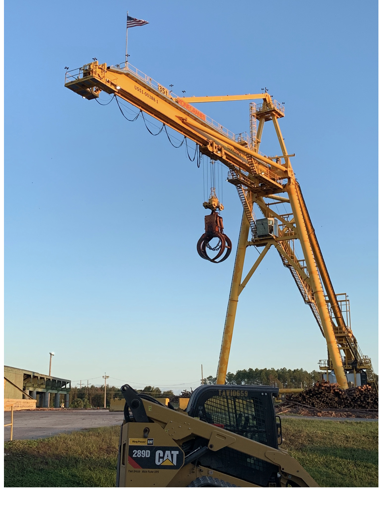
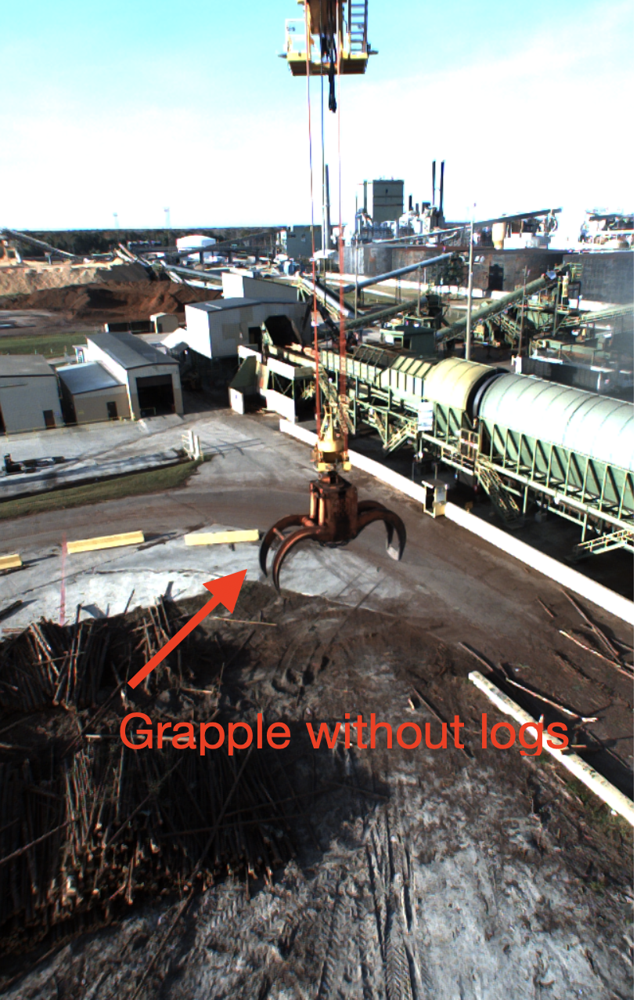
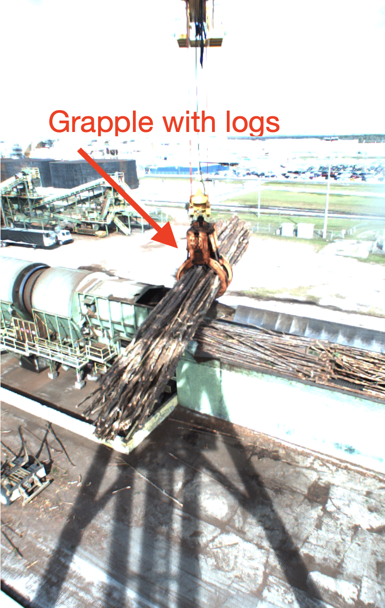
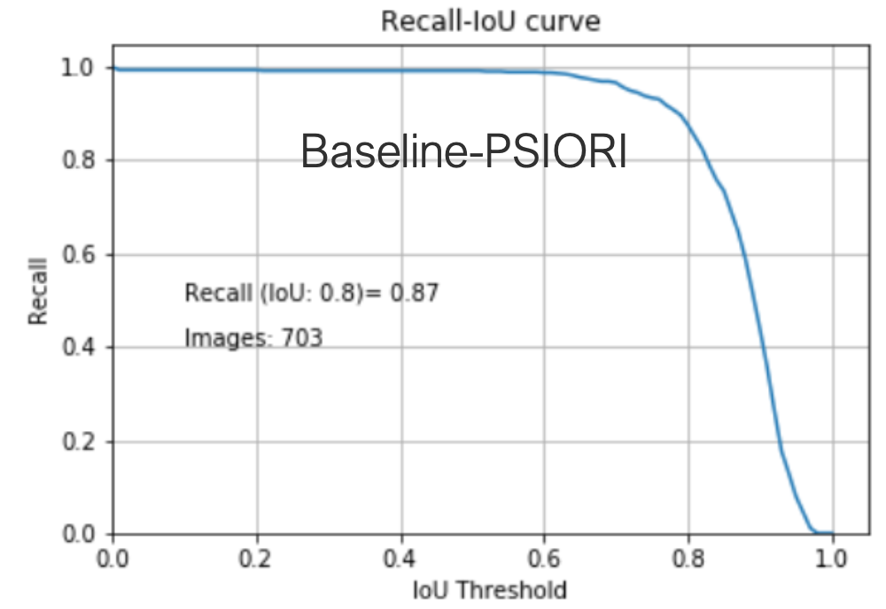

# Autocrane Competition

This is a dataset for Machine Learning benchmarking. The work was supported by the German Federal Ministry of Education and Research (BMBF) via the DeToL project grant.

# Introduction

Circular cranes are used in the paper processing industry. Logs are delivered by lorries. The logs can be put directly into the intake funnel or can be stored on the log pile. PSIORI is working on automating tasks like unloading a lorry, depositing logs on the log pile, picking up logs from the log pile and depositing logs in the intake funnel. The basic task to enable these behaviors is the detecting of the grapple and to classify whether there is wood in the grapple or not.

<table><tr>
<td>  </td>
<td>  </td>
<td>  </td>
</tr></table>

# Competition 1: Grapple Detection
The aim of this competition is to detect the grapple. In [autocrane-grapple-data](https://seafile.psiori.com/d/5a309b8297444b03b2dd) you can find 3982 labeled grapple images of the size 1024 * 648 * 3.

## Tasks
* Get an overview of the data

* Look at the evaluation jupyter-notebook 
* Tensorflow
  * Tensorflow [Tensorflow_Grapple_evaluation.ipynb](Grapple/Tensorflow_Grapple_evaluation.ipynb)
  * Look at the module [processing.py](Grapple/processing.py)
* Pytorch 
  * [Pytorch_Grapple_evaluation.ipynb](Grapple/Pytorch_Grapple_evaluation.ipynb)
  * [Pytorch_Grapple_model_development.ipynb](Grapple/Pytorch_Grapple_model_development.ipynb)
* Build a grapple detection model

## Submission
* Tensorflow
  * Model as .h5-file [grapple.h5](https://www.tensorflow.org/tutorials/keras/save_and_load)
  * Modified file [processing.py](Grapple/processing.py)
* Pytorch
  * [Pytorch_Grapple_evaluation.ipynb](Grapple/Pytorch_Grapple_evaluation.ipynb)
  * Model-File

## Evaluation
The evaluation is performed with the [grapple_evaluation.ipynb](Grapple/grapple_evaluation.ipynb) / [Pytorch_Grapple_evaluation.ipynb](Grapple/Pytorch_Grapple_evaluation.ipynb) notebook. For the final ranking a secret dataset with 703 images will be used. As evaluation metric the „intersection over union“ (IoU) per image is calculated. Afterwards all images are evaluated as correct if the IoU value is greater or equal 80%. The final score is obtained by dividing the number of true positives by the number of all images. The module „grapple_evaluation_helper.py“ contains an implementation of the metric. PSIORI's model achieves a score of 0.87%.

# Competition 2: Logs Classification
The aim of this competition is to classify whether there are logs in the grapple. In [autocrane-logs-data](https://seafile.psiori.com/d/42c6cc05c558449ab537/) you can find 10968 (5873 without Logs; 5095 with Logs) labeled log images with the size 1024 * 648 * s3.

## Tasks
* Get an overview of the data
* Look at the evaluation jupyter-notebook 
* Tensorflow
  * [Tensorflow_Logs_evaluation.ipynb](Logs/Tensorflow_Logs_evaluation.ipynb)
  * Look at the module [processing.py](Logs/processing.py)
* Pytorch
  * [Pytorch_Logs_evaluation.ipynb](Logs/Pytorch_Logs_evaluation.ipynb)
  * [Pytorch_Logs_model_development.ipynb](Logs/Pytorch_Logs_model_development.ipynb)
* Build a logs classification model

## Submission
* Tensorflow
  * Model as .h5-file [logs.h5](https://www.tensorflow.org/tutorials/keras/save_and_load)
  * Modified file [processing.py](Logs/processing.py)
* Pytorch
  * [Pytorch_Logs_evaluation.ipynb](Grapple/Pytorch_Logs_evaluation.ipynb)
  * Model-File

## Evaluation
The evaluation is performed with the [Tensorflow_Logs_evaluation.ipynb](Logs/Tensorflow_Logs_evaluation.ipynb) /  [Pytorch_Logs_evaluation.ipynb](Logs/Pytorch_Logs_evaluation.ipynb) notebook. For the final ranking a secret dataset with 1225 images will be used. Accuracy ((TP+TN) / (TP+TN + FP + FN)) is used as the evaluation criterion. The module „logs_evaluation_helper.py“ contains an implementation of the metric.

PSIORI's model achieves an accuracy of 0.98%.

## Competition 2 b: Logs Classification and Representation
The aim of this competition is to classify whether there are logs in the grab. The task should be performed by a suitable representation and not directly by the pictures. First of all a representation (e.g. autoencoder) must be found.  Afterwards the task of classification is carried out on the representation. A simple baseline model for the task can be found a xyz.First of all a representation (e.g. autoencoder) must be found.  Afterwards the task of classification is carried out on the representation.At [simple_Model](resources/representation_and_classification) a simple baseline model for the task can be found.  It reaches an accuracy of 0.76 %. Can you find a model which is better? A more sophisticated model achieves an accuracy of 0.98%. Does your solution achieve a similar score? 

# Baseline-Models
Below you will find the Baseline models: 
[cabin_cam_grapple_detector](resources/cabin_cam_grapple_detector) and [cabin_cam_grapple_detector](resources/cabin_cam_grapple_detector). The notebook [Baseline.ipynb](extra/Baseline.ipynb) and the module [model_loader.py](extra/model_loader.py) support the model inference. 
